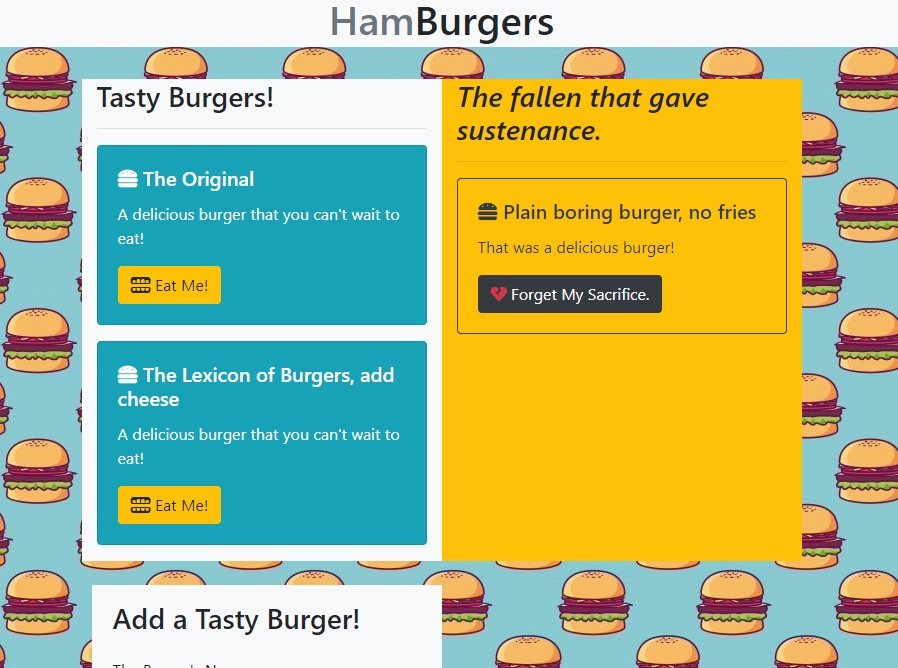

# Eat Da Burger

An app that lets you make da burger, then eat da burger.

## Table of Contents

- [Description](#Description)

- [Usage Guide](#Usage-Guide)

- [Questions and Reporting](#Questions-and-Reporting)

## Description

Are you dieting? Holed up hiding from the po-po? Or just hundreds of miles from the nearest burger joint? This app lets you eat da burger, even if you don't have access to da burger. Enter new burgers to eat, eat them, then (if you're feeling rude and selfish) delete all traces of their noble sacrifice.

## Usage Guide

Using this app is as simple as navigating in a browser to https://blooming-beach-22911.herokuapp.com/. If you managed to do that correctly, it should look like this:

Once there, the user can simply add a new burger, or eat da burgers that are already provided. When thinking up burgers, the sky is the limit!

## Questions and Reporting

This app was an assignement to help me learn server-side programming and model-view-controllers. I do not forsee updating this at any time, as it's prefect just the way it is. If, for some reason, you feel the need to use my app and run into problems, feel free to contact me through [my github](https://kirkpatrickpaul.github.io/contact.html).
